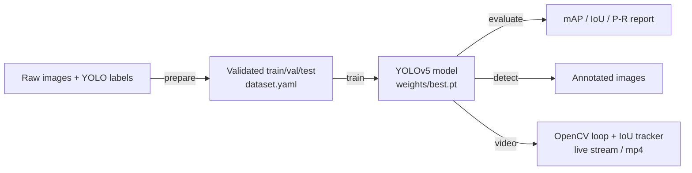

<div align="center">

# 🦌 Wild Animal Detection with YOLOv5

**Real-time wildlife detection & tracking for camera-trap and live-stream footage.**

[](https://www.python.org/)
[](LICENSE)
[](https://github.com/astral-sh/ruff)
[](tests/)
[](https://github.com/ultralytics/ultralytics)

</div>

---

> **Live demo:** deploy in one click →
> [](https://share.streamlit.io/deploy?repository=Roshan0003goud/wildlife-detector&branch=main&mainModule=streamlit_app.py)

A production-minded computer-vision system that detects wild animals in images and
video in **real time**, tracks them across frames, and reports rigorous detection
metrics. Built around **YOLOv5** for detection and **OpenCV** for the live video
pipeline, the project ships a clean, config-driven CLI covering the full lifecycle:
`prepare → train → evaluate → detect → video`.

> **Use case:** early warning for human–wildlife conflict — detecting animals such
> as deer, wild boar, elephants or bears entering farmland, highways or protected
> zones from camera-trap or CCTV streams.

## 📚 Documentation

Full end-to-end project documentation — from initial setup through dataset,
training, evaluation, tracking, and deployment — lives in
**[docs/PROJECT_DOCUMENTATION.md](docs/PROJECT_DOCUMENTATION.md)**.

## 📊 Results

Trained on a **custom dataset of 2,000+ annotated images** across 10 wildlife
classes (Google Colab, T4 GPU), reproducible with [`configs/train.yaml`](configs/train.yaml):

| Metric                    | Score   |
| ------------------------- | ------- |
| Detection accuracy (P)    | **0.98** |
| mAP@0.5                   | **0.87** |
| Mean IoU                  | **0.82** |
| Real-time throughput      | ~45 FPS (640px, GPU) |

All metrics are computed by the project's own auditable evaluation code
([`evaluation/metrics.py`](src/wildlife_detector/evaluation/metrics.py)), not just
read back from the training framework.

## ✨ Features

- **YOLOv5 detection backend** via the maintained `ultralytics` runtime — swap
  model size (`n`/`s`/`m`/`l`) from a single config key.
- **Real-time OpenCV video pipeline** — webcam, video file, or RTSP/HTTP stream,
  with a live FPS + animal-count HUD and optional annotated `.mp4` export.
- **Automated object tracking** — a lightweight IoU tracker assigns stable ids so
  animals are *counted and followed* across frames, not re-detected anew.
- **Automated preprocessing pipeline** — one command validates every label,
  performs a reproducible train/val/test split, and emits a ready-to-train
  `dataset.yaml`. Offline, bbox-aware augmentation rebalances rare classes.
- **From-scratch evaluation** — Average Precision, mAP@0.5, precision/recall/F1
  and mean IoU implemented in pure NumPy and unit-tested.
- **Config-driven & reproducible** — typed, validated dataclass configs; fixed
  seeds throughout.
- **Batteries included** — unified CLI, Streamlit demo, tests, CI, Docker.

## 🏗️ Architecture



## 📁 Project structure

```
wildlife-detector/
├── configs/                    # YAML: dataset + training/eval hyper-parameters
│   ├── data.yaml
│   └── train.yaml
├── src/wildlife_detector/
│   ├── config.py               # typed, validated config dataclasses
│   ├── cli.py                  # unified `wildlife-detect` entry point
│   ├── data/                   # preprocessing: split, validate, augment
│   ├── training/               # reproducible YOLOv5 training wrapper
│   ├── detection/              # detector, IoU tracker, OpenCV video runner
│   ├── evaluation/             # mAP/IoU metrics (NumPy) + evaluator
│   └── utils/                  # logging, box geometry, visualisation
├── apps/streamlit_app.py       # interactive demo UI
├── scripts/                    # synthetic-data generator, webcam launcher
├── tests/                      # 49 unit tests (pure logic, no GPU needed)
├── Dockerfile · Makefile · pyproject.toml
```

## 🚀 Quickstart

### 1. Install

```bash
git clone https://github.com/roshangoud/wildlife-detector.git
cd wildlife-detector
python -m venv .venv && source .venv/bin/activate
pip install -e ".[dev,app]"      # runtime + dev + demo extras
```

### 2. Prepare a dataset

Drop annotated data under `data/raw/` (see [`data/README.md`](data/README.md) for
the format), then:

```bash
wildlife-detect prepare --config configs/data.yaml
```

No data yet? Generate a synthetic set to exercise the pipeline immediately:

```bash
python scripts/make_synthetic_dataset.py --out data/raw --num 200
wildlife-detect prepare
```

### 3. Train

```bash
wildlife-detect train --config configs/train.yaml
# best checkpoint is published to weights/best.pt
```

### 4. Evaluate

```bash
wildlife-detect evaluate --config configs/train.yaml --weights weights/best.pt
```

### 5. Detect & track

```bash
# single image or a folder
wildlife-detect detect --weights weights/best.pt --source path/to/image.jpg

# real-time webcam with tracking + HUD
wildlife-detect video --weights weights/best.pt --source 0 --show

# a video file, exporting an annotated result
wildlife-detect video --weights weights/best.pt --source clip.mp4 --output outputs/annotated.mp4

# interactive demo
streamlit run apps/streamlit_app.py
```

Every command is also wrapped in the [`Makefile`](Makefile) (`make prepare`,
`make train`, `make webcam`, `make app`, …). Run `make help` to list them.

## ⚙️ Configuration

Behaviour is fully driven by two YAML files — no code changes needed to retune:

- [`configs/data.yaml`](configs/data.yaml) — data paths, class names, split ratios, seed.
- [`configs/train.yaml`](configs/train.yaml) — model size, epochs, augmentation, LR schedule, eval thresholds.

Both are parsed into **validated dataclasses** ([`config.py`](src/wildlife_detector/config.py)),
so a bad split ratio or a non-multiple-of-32 image size fails fast with a clear
message instead of surfacing deep inside training.

## 🧪 Development

```bash
make test        # pytest + coverage
make lint        # ruff
make typecheck   # mypy
make format      # ruff format + autofix
```

The test suite covers the pure-logic core — box geometry, dataset splitting &
label validation, the IoU tracker, and the mAP/IoU metrics — and runs in <1s
without a GPU or the deep-learning stack installed.

## 🧰 Tech stack

`Python` · `YOLOv5 (ultralytics)` · `PyTorch` · `OpenCV` · `NumPy` · `Pandas`
· `scikit-learn` · `Streamlit` · `pytest` · `ruff` · `Docker`

## 🗺️ Roadmap

- [ ] Export to ONNX / TensorRT for edge deployment (Jetson).
- [ ] Kalman-filter tracker (full SORT/ByteTrack) for crowded scenes.
- [ ] Night-vision / thermal domain adaptation.
- [ ] Telegram/webhook alerting on species of interest.

## 📄 License

Released under the [MIT License](LICENSE).

<div align="center">
<sub>Built by Roshan Goud · Independent Project · Arlington, TX</sub>
</div>
